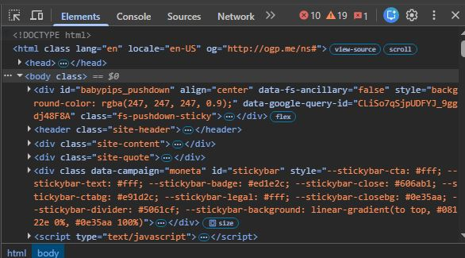

# DevTools Exploration
## Website 1
1. The HTML tags used on the page are: 
    - !Doctype html
    - html
    - head
    - title
    - meta
    - style
    - body
    - div
2. The page title is **example.com**
3. There are no headings.

## Website 2
1. The navigation menu is wrapped in the body tag
2. The search bar is contained in a *div* tag which has a *class* element a *title* tag and a *button* tag.
3. When you hover over the links the developer inspect tools highlight the specific used on the link you have hovered over.

## Website 3
1. On [babypips.com](https://www.babypips.com/) there are the **div, section, script, footer and iframe** elements.
2. The inputs of the form element are: 
    ```html
    <form id="user-form" action="/submit" method="POST">
        <input type="text" name="username" placeholder="Username">
        <button type="submit">Submit</button>
    </form>
    ```
3. 

